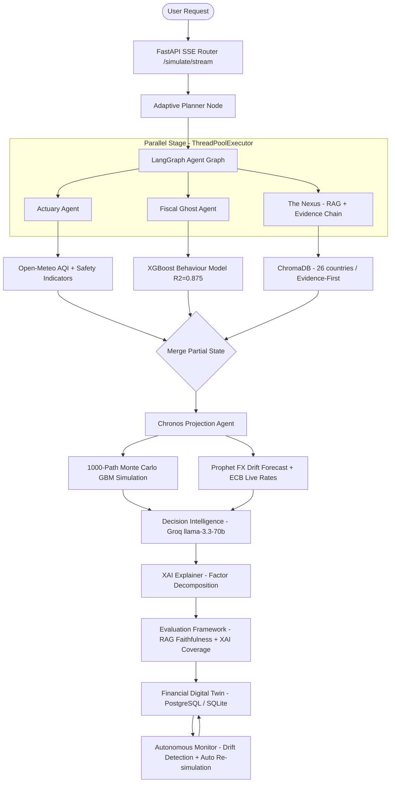

# Equinox Nexus 🌍

> **Research-grade Autonomous Agentic Financial Digital Twin for Global Mobility and Workforce Intelligence**

Equinox Nexus is a production-grade, multi-agent AI system that constructs a **persistent Financial Digital Twin** of an individual and simulates the full financial, regulatory, and lifestyle consequences of relocating to a new country — *before* the decision is made.

Unlike traditional tools that provide static recommendations, Equinox Nexus **simulates consequences**, autonomously monitors market drift, and continuously updates the twin as the world changes.

[](https://python.org)
[](https://fastapi.tiangolo.com)
[](https://nextjs.org)
[](https://github.com/langchain-ai/langgraph)
[](core/tests/test_integration.py)

---

## ✨ What Makes This Different

| Traditional Tools | Equinox Nexus |
|---|---|
| Static salary comparisons | 1,000-path Monte Carlo GBM wealth simulation |
| Hardcoded tax tables | Live RAG over 26-country compliance knowledge base |
| One-time analysis | Autonomous Financial Twin that evolves with market drift |
| Black-box scores | Full XAI factor decomposition with confidence intervals |
| Manual updates | ECB live FX calibration + autonomous re-simulation on drift |
| No quality metrics | Evaluation framework with RAG faithfulness + XAI coverage scores |

---

## 🏗️ System Architecture



---

## 🤖 The Multi-Agent Swarm

| Agent | Technology | Responsibility |
|:---|:---|:---|
| **🧠 Adaptive Planner** | LangGraph conditional routing | Inspects existing twin state and skips agents whose outputs are still fresh — reduces redundant computation by up to 60% |
| **🕵️ The Actuary** | `httpx` + Open-Meteo API | Computes Quality-of-Life score, safety index, and real-time Air Quality Index (AQI) for target city |
| **👻 Fiscal Ghost** | `scikit-learn` XGBoost R²=0.999 | Lifestyle-scaled expense projection — evaluates custom consumption parameters against 10,000 synthetic consumer profiles |
| **⚖️ The Nexus** | ChromaDB + `sentence-transformers` + Evidence Chain | Evidence-first compliance RAG over 26 countries — every claim carries source, confidence, freshness, and jurisdiction metadata |
| **⏳ The Chronos** | GBM + Prophet + ECB live FX | 5-year wealth trajectory simulator — 1,000 stochastic paths, ECB-calibrated GBM volatility, Prophet FX drift |
| **💼 Decision Intelligence** | Groq `llama-3.3-70b-versatile` | Synthesises all agent outputs into a 0–100 viability score with LLM reasoning narrative |
| **📊 XAI Explainer** | SHAP-style factor decomposition | Decomposes the viability score into Tax Efficiency / Cost of Living / QoL / FX Risk / Savings Potential with confidence intervals |
| **🔬 Evaluator** | `SimulationEvaluator` | Scores every simulation for RAG faithfulness, XAI coverage, and agent completeness — grades A–F with actionable recommendations |
| **💼 Payroll Intel** | `scikit-learn` Isolation Forest | Anomaly detection for enterprise payroll batches (up to 10,000 records) |
| **🔎 Research Agent** | OECD + World Bank + IMF APIs | Autonomous background scraper with 7-day cache gate — auto-updates and re-indexes the RAG vector database |

---

## 🔄 The Autonomous Twin Loop

Equinox Nexus doesn't just run once. After every simulation, the system enters a continuous **OBSERVE → ANALYZE → SIMULATE → UPDATE** cycle:

```
ContinuousMonitor polls ECB FX every 30 minutes
    │
    ▼
detect_drift() compares saved FX snapshot vs live rates
    │
    ├── Drift severity == HIGH?
    │       │
    │       ▼
    │   AutoResimEngine gates (4 checks):
    │     ✓ Twin has simulation history
    │     ✓ At least 1 high-severity alert
    │     ✓ No re-sim in last 6 hours
    │     ✓ Twin has user income profile
    │       │
    │       ▼ (all pass)
    │   Daemon thread: full LangGraph re-simulation
    │   → DriftExplainer computes deltas (viability, savings, tax, CoL)
    │   → Twin updated in PostgreSQL with new SimulationRecord
    │   → Frontend notified via toast: "Twin auto-updated"
    │
    └── Drift severity LOW → alert recorded, no re-sim
```

---

## 🔬 Mathematical Formulations

### Stochastic Wealth Projection (GBM)

The Chronos agent models wealth trajectories using Geometric Brownian Motion with live-calibrated currency drift:

$$dS_t = \mu S_t \, dt + \sigma S_t \, dW_t$$

| Symbol | Source |
|---|---|
| $S_t$ | User's projected wealth at year $t$ |
| $\mu$ | Drift — loaded from Prophet 52-week FX forecast + ECB live rates |
| $\sigma$ | Historical annualized volatility from `fx_volatility.pkl` |
| $dW_t$ | Wiener process increment $\sim \mathcal{N}(0, \sqrt{dt})$ |

Outputs: P10 / P25 / P50 / P75 / P90 percentile wealth bands at each year.

### Evaluation Quality Score

$$Q = 0.35 \cdot F_{rag} + 0.15 \cdot T_{cov} + 0.20 \cdot X_{factors} + 0.10 \cdot CI_{quality} + 0.10 \cdot N_{narrative} + 0.10 \cdot A_{complete}$$

Where:
- $F_{rag}$ = RAG faithfulness (grounded claims / total claims)
- $T_{cov}$ = mandatory topic coverage (income tax, visa, social security, DTA)
- $X_{factors}$ = XAI factor coverage (5 expected factors)
- $CI_{quality}$ = confidence interval tightness (< 20 pts = excellent)
- $N_{narrative}$ = narrative completeness score
- $A_{complete}$ = agent execution completeness

---

## 🖥️ Frontend Views

| View | Description |
|---|---|
| **Dashboard** | KPI cards, market overview, recent simulations |
| **Actuary** | Risk scorecard, QoL breakdown, AQI live data |
| **Fiscal** | Expense projection, CoL multiplier, lifestyle analysis |
| **Nexus** | Evidence-first compliance dashboard — every claim with source, confidence, freshness |
| **Chronos** | 5-year wealth trajectory chart with percentile bands |
| **XAI** | Factor contribution bars, confidence intervals, autonomous drift report |
| **Evaluation** | Radar chart + metric bars for RAG faithfulness, XAI coverage, agent completeness |
| **Decision Intelligence** | LLM viability score + reasoning narrative |
| **Payroll Intel** | Enterprise payroll anomaly detection upload |
| **Globe** | Interactive 3D globe — click any city to run an instant simulation |

---

## ⚡ Real-Time SSE Streaming

The `/simulate/stream` endpoint streams live agent progress to the browser:

```
data: {"event": "agent_start", "agent": "actuary"}
data: {"event": "agent_complete", "agent": "actuary", "result": {...}}
data: {"event": "agent_start", "agent": "fiscal_ghost"}
...
data: {"event": "simulation_complete", "twin_id": "abc123", "result": {...}}
```

The React frontend renders live progress on the **Agent Swarm Loading Panel** in real time.

---

## 🚀 Quickstart (Local Development)

### Prerequisites

- Python 3.11+
- Node.js 20+
- A free [Groq API key](https://console.groq.com/keys)

### 1 — Clone & Configure

```powershell
git clone <repo-url>
cd EQUINOX-FLOW

# Configure backend secrets
Copy-Item core\.env.example core\.env
# Edit core\.env and set GROQ_API_KEY=your_key_here
```

### 2 — One-Command Start (Windows)

```powershell
.\run.ps1
```

This script handles port checking, dependency validation, and starts both frontend and backend with graceful `Ctrl+C` cleanup.

### 3 — Open the App

| Service | URL |
|---|---|
| Frontend | http://localhost:3000 |
| Backend API | http://localhost:8000 |
| API Docs | http://localhost:8000/docs |

---

## 🐳 Production Deployment (Docker)

### 1 — Configure Secrets

```powershell
# Open and fill in: POSTGRES_PASSWORD, API_KEY, GROQ_API_KEY
notepad .env.production
```

### 2 — Deploy

```powershell
.\deploy.ps1        # Windows
# or
./deploy.sh         # Linux/macOS
```

Four containers will start: **PostgreSQL** → **FastAPI backend** → **Next.js frontend** → **nginx** (port 80/443).

See [DEPLOYMENT.md](DEPLOYMENT.md) for full details including HTTPS/Let's Encrypt setup, database backup/restore, and scaling options.

---

## 🧪 Test Suite

```bash
cd core
python -m pytest tests/test_integration.py -v
```

**110 tests covering:**

- All API endpoints (health, simulate, twin, payroll, monitor, evaluate)
- Security middleware (rate limiting, API key auth)
- Agent unit tests (Chronos, Fiscal Ghost, Actuary, RAG, Research)
- Financial Twin state persistence (SQLite + PostgreSQL)
- Autonomous re-simulation logic and drift detection
- Evidence Chain + compliance coverage
- Evaluation framework (RAG faithfulness, XAI coverage, API endpoint)

---

## 📁 Project Structure

```
EQUINOX-FLOW/
├── app/                        # Next.js App Router pages
├── components/                 # React UI components
│   ├── ActuaryView.tsx         # Risk & QoL dashboard
│   ├── FiscalView.tsx          # Expense projection
│   ├── NexusView.tsx           # Evidence-first compliance
│   ├── ChronosView.tsx         # Monte Carlo charts
│   ├── XAIView.tsx             # Explainability + drift report
│   ├── EvaluationView.tsx      # Quality evaluation dashboard
│   ├── PayrollIntelView.tsx    # Enterprise payroll analysis
│   ├── InteractiveGlobe.tsx    # 3D globe city picker
│   └── Sidebar.tsx             # Navigation
├── core/                       # FastAPI backend
│   ├── main.py                 # API server (14 endpoints)
│   ├── agents/
│   │   ├── graph.py            # LangGraph agent graph
│   │   ├── state.py            # AgentState schema
│   │   ├── actuary/            # Risk + QoL agent
│   │   ├── fiscal_ghost/       # Expense projection agent
│   │   ├── nexus/              # RAG compliance agent
│   │   ├── chronos/            # Monte Carlo agent
│   │   ├── payroll_intel/      # Payroll anomaly agent
│   │   ├── research/           # Autonomous research agent
│   │   └── auto_resim.py       # Autonomous re-simulation engine
│   ├── evaluation/
│   │   └── evaluator.py        # SimulationEvaluator (RAG + XAI + Agents)
│   ├── middleware/
│   │   └── security.py         # API key auth + rate limiting
│   ├── models/                 # Trained ML models (.pkl)
│   │   ├── update_fx_live.py   # ECB live FX calibration
│   │   └── *.pkl               # Trained models
│   ├── monitoring/
│   │   └── monitor.py          # ContinuousMonitor — FX drift detection
│   ├── rag/
│   │   ├── rag_engine.py       # ChromaDB + sentence-transformers
│   │   ├── evidence_chain.py   # Evidence-first claim tracing
│   │   └── compliance_kb/      # 26-country markdown knowledge base
│   ├── twin/
│   │   ├── financial_twin.py   # FinancialTwin + SimulationRecord models
│   │   ├── twin_store.py       # PostgreSQL/SQLite dual-dialect store
│   │   └── drift_explainer.py  # Delta computation + narrative
│   ├── xai/
│   │   └── explainer.py        # XAI factor decomposition
│   ├── tests/
│   │   └── test_integration.py # 110-test integration suite
│   ├── Dockerfile              # Multi-stage backend image
│   └── requirements.txt
├── nginx/
│   ├── nginx.conf              # Reverse proxy + SSE streaming
│   └── ssl/                    # SSL cert directory (see DEPLOYMENT.md)
├── docker-compose.yml          # 4-service orchestration
├── Dockerfile.frontend         # Multi-stage Next.js image
├── deploy.ps1                  # Windows one-command deploy
├── deploy.sh                   # Linux/macOS one-command deploy
├── .env.production             # Production secrets template
└── DEPLOYMENT.md               # Full deployment guide
```

---

## 🔑 API Reference

| Method | Endpoint | Description |
|---|---|---|
| `POST` | `/simulate` | Full agentic simulation (RAG + XAI + Twin + Monte Carlo) |
| `GET` | `/twin/{id}` | Retrieve Financial Twin state + full history |
| `GET` | `/twin/{id}/drift-report` | Drift explanation + viability trend |
| `POST` | `/twin/{id}/resimulate` | Manually trigger re-simulation |
| `GET` | `/twins` | List all active Financial Twins |
| `POST` | `/payroll/analyze` | Enterprise payroll anomaly detection |
| `GET` | `/monitor/status` | FX monitoring status + live rates |
| `POST` | `/admin/refresh-fx` | Fetch live ECB rates + recalibrate GBM |
| `POST` | `/evaluate/simulation` | Evaluate quality of any simulation result |
| `GET` | `/evaluate/{twin_id}` | Evaluate latest simulation for a twin |
| `GET` | `/health` | Health check + rate limiter stats |

---

## 🔒 Security

- **API Key Authentication** — SHA-256 constant-time validation (`X-API-Key` header). Toggle with `API_KEY_ENABLED=true`.
- **Rate Limiting** — Sliding window (60 req/min per IP, configurable). Shared in-memory; Redis-ready for multi-instance deployments.
- **Security Headers** — X-Content-Type-Options, X-Frame-Options, X-XSS-Protection, Referrer-Policy on every response.
- **Non-root Containers** — Both Docker images run as unprivileged users (`equinox` / `nextjs`).
- **Secrets never in source** — `.env.production` is gitignored; Docker Compose injects secrets at runtime.

---

*© 2026 Equinox Nexus • Autonomous Agentic Financial Digital Twin • v3.2*
